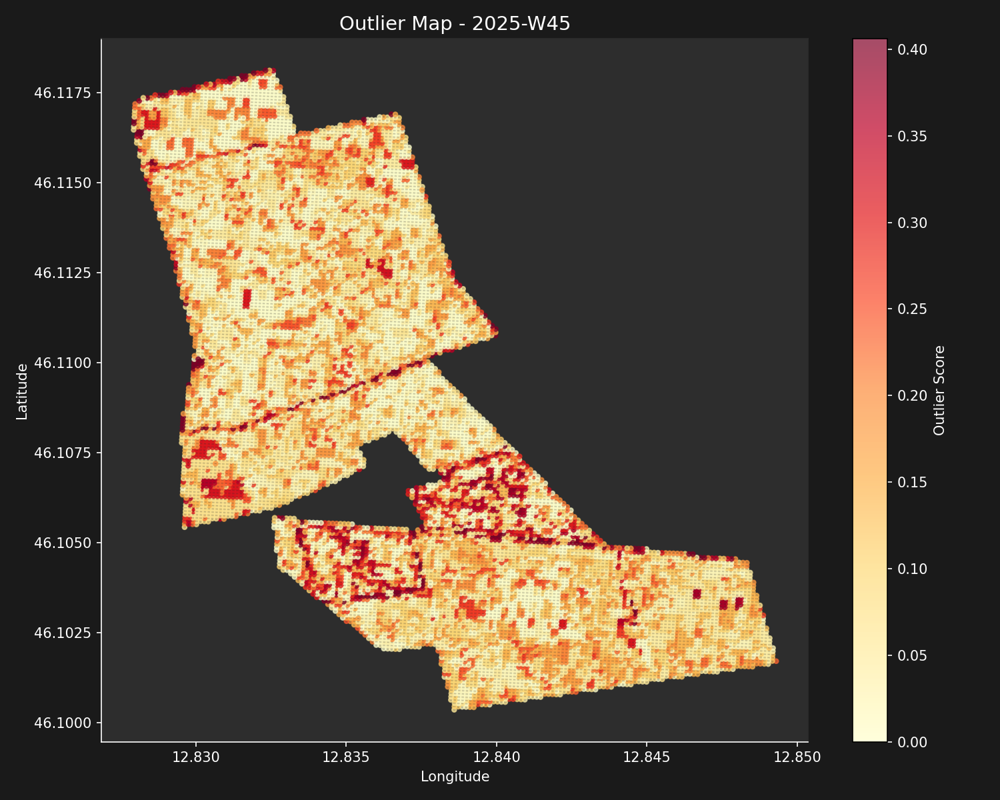
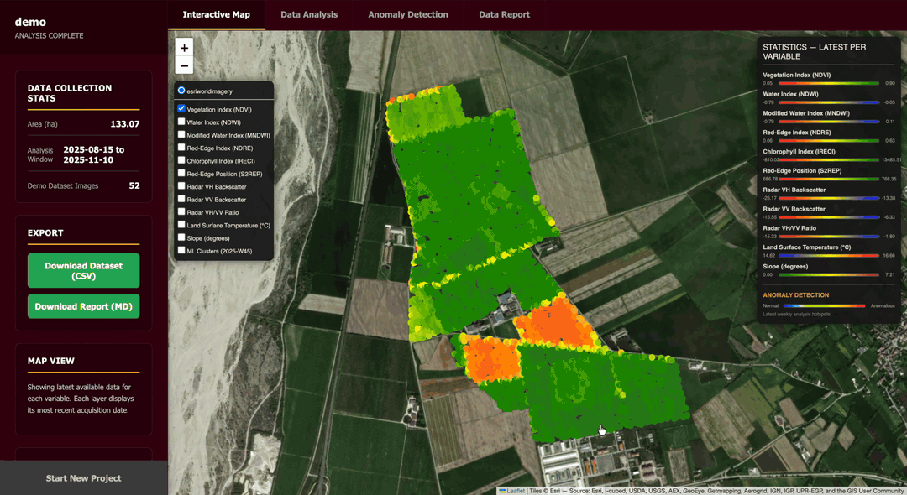
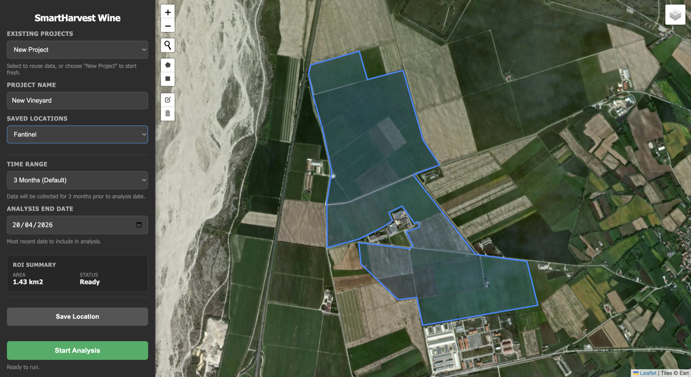
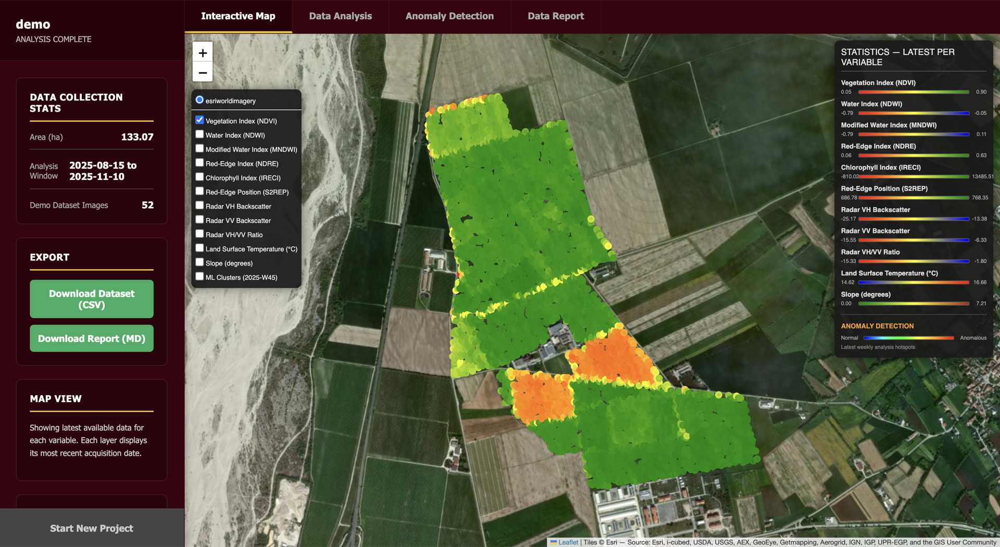
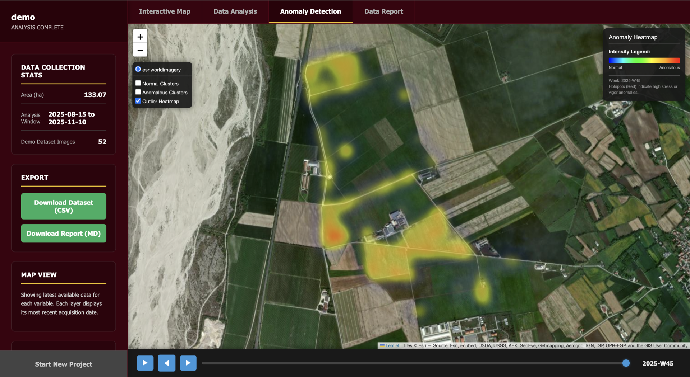
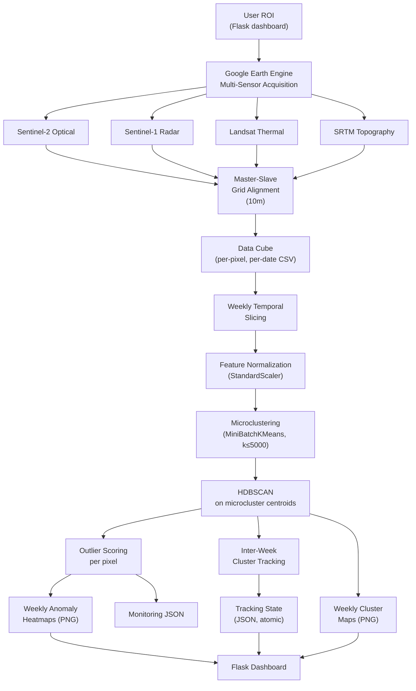
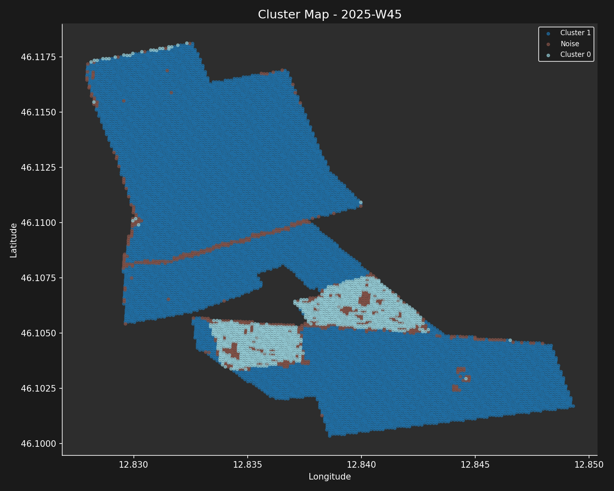

<h1 align="center">🍇 SmartHarvest</h1>

<p align="center">
  <em>Multi-sensor satellite fusion + weekly HDBSCAN anomaly detection for precision viticulture.</em>
</p>

<p align="center">
  
</p>

<p align="center">
  Exam of Machine Learning Operations 30/30 · A.A. 2025-26 · M.Sc. Artificial Intelligence and Data Analytics · University of Trieste
</p>

<p align="center">
  
  
  
  
  
  
  
</p>

<p align="center">
  <strong>Lorenzo Di Bernardo</strong> &nbsp;|&nbsp; <strong>Giovanni Mason</strong>
  <br/>
  <em>University of Trieste — M.Sc. Artificial Intelligence and Data Analytics</em>
</p>

---

## What SmartHarvest Does

A commercial vineyard is never uniform. Two vines in the same row can follow opposite growth trajectories because of microtopography, soil drainage, water balance, and vigour. Traditional winemaking either ignores this variability — producing a mean wine that averages the best and worst parts of the field — or addresses it through manual field surveys, which are expensive, time-limited, and sample only a handful of points.

**SmartHarvest turns free public satellite data into weekly vineyard zonation maps.** It ingests multi-sensor imagery from Google Earth Engine (Sentinel-2 optical, Sentinel-1 radar, Landsat 8/9 thermal, SRTM topography), fuses them onto a 10-metre master grid, runs density-based clustering (MiniBatchKMeans → HDBSCAN) on the weekly feature cube, tracks clusters across weeks, and produces cluster maps, anomaly heatmaps, and monitoring artefacts that an operator can inspect in an interactive Flask dashboard.

**This is not a notebook. It is a working pipeline that ingests real Sentinel data from real vineyards and produces weekly anomaly maps.**

<p align="center">
  
</p>

<p align="center"><em>Week-W45 anomaly heatmap on the Fantinel37 vineyard in Friuli. Each pixel is weighted by its HDBSCAN outlier score; bright regions indicate anomalous behaviour relative to the dominant modes of the feature distribution.</em></p>

---

## Demo

<p align="center">
  
</p>

<p align="center"><em>End-to-end walk-through: <code>docker compose up demo</code> runs the full ML pipeline on the bundled Fantinel37 snapshot, then the Flask dashboard renders weekly cluster maps and the anomaly heatmap. <a href="docs/screenshots/demo.mp4">▶ Watch the HD clip (MP4)</a>.</em></p>

Everything runs on your laptop. No cloud account, no credentials, no pre-computed results.

1. **Clone the repo.**
2. **`docker compose up demo`** — builds the image and runs the ML pipeline on a bundled Fantinel37 snapshot.
3. **Wait ~30 seconds.** The container processes 13 weeks of real vineyard data through the full clustering + tracking pipeline.
4. **Inspect outputs** under `output/demo/ml_weekly/weekly/`: one `cluster_image_<week>.png` and one `outlier_image_<week>.png` per week, plus an interactive Folium map per week.
5. **(Optional) `python app.py`** for the interactive Flask dashboard at <http://127.0.0.1:5001>.

### Dashboard Walk-through

<p align="center">
  
</p>

<p align="center"><em>Landing page: pick a project name, set the acquisition parameters, and draw the vineyard boundary directly on the interactive map. The polygon becomes the project's spatial footprint for every subsequent acquisition.</em></p>

<p align="center">
  
</p>

<p align="center"><em>Dashboard: multi-layer map view of the processed project. Each variable (NDVI, VH, LST, Slope, …) can be toggled from the layer control; the sidebar summarises project stats and exposes the CSV/Report exports.</em></p>

<p align="center">
  
</p>

<p align="center"><em>Anomaly Detection tab: weekly timeline scrubber over the Fantinel37 vineyard with the HDBSCAN outlier heatmap active by default; the Normal and Anomalous cluster layers can be toggled on from the layer control.</em></p>

---

## Quick Start

### Demo Mode (Docker, no Google Earth Engine required)

```bash
git clone https://github.com/diiibe/MLOPS-SmartHarvest.git
cd MLOPS-SmartHarvest
docker compose up demo
```

The demo service mounts `./output` into the container, runs `bash demo/run_demo.sh`, and exits when the pipeline finishes. Outputs land in your local `output/demo/` directory.

### Full Mode (with Google Earth Engine)

<details>
<summary><strong>Click to expand — requires a Google Earth Engine account</strong></summary>

```bash
# 1. Clone and set up a virtualenv
git clone https://github.com/diiibe/MLOPS-SmartHarvest.git
cd MLOPS-SmartHarvest
python3 -m venv .venv && source .venv/bin/activate
pip install -r requirements.txt

# 2. Authenticate with Google Earth Engine
earthengine authenticate

# 3. Launch the interactive Flask dashboard
python app.py
# Open http://127.0.0.1:5001
# (override with SMARTHARVEST_PORT=5000 if AirPlay Receiver is disabled)
```

From the dashboard you can create a new project, draw a vineyard ROI on the interactive map, and trigger acquisition + ML analysis. Or run the core pipeline directly:

```bash
python main.py                          # full acquisition + assembly + ML
python run_ml_weekly.py <project_name>  # ML only, on an existing data cube
```

</details>

<details>
<summary><strong>Environment Variables</strong></summary>

| Variable | Default | Description |
|---|---|---|
| `MPLBACKEND` | `Agg` (in Docker) | Matplotlib backend. Agg is required for headless container runs. |

</details>

<details>
<summary><strong>Setup Notes</strong></summary>

- **Docker image size** is ~2.5 GB because `earthengine-api` and its transitive dependencies are installed even though the demo path does not use them. A future optimisation would split `requirements.txt` into `requirements-core.txt` and `requirements-gee.txt` and build two targets.
- **First Docker build** takes ~5 minutes (dependency installation). Subsequent builds use cached layers and take seconds.
- **First ML run** on a new project is slower than subsequent runs because the pipeline writes incremental weekly state under `output/<project>/ml_weekly/`.
- **The bundled demo dataset** is a stratified random subsample of the real Fantinel37 pipeline output (5,000 pixels per week × 14 weeks ≈ 70,000 rows, seed = 42). The full source CSV is 207 MB and too large to commit.

</details>

---

## What the Pipeline Delivers

| Output | Implementation | Where to See It |
|---|---|---|
| **Multi-sensor data cube** | Sentinel-2 (NDVI, NDWI, MNDWI, NDRE, IRECI, S2REP) + Sentinel-1 (VH, VV, Ratio) + Landsat LST + SRTM Slope, aligned on a 10m Master-Slave Grid | `output/<project>/SmartHarvest_<project>.csv` |
| **Weekly cluster maps** | MiniBatchKMeans microclustering (up to 5000 centroids) followed by HDBSCAN on the microcluster centroids | `output/<project>/ml_weekly/weekly/<YYYY-Wxx>/cluster_image_<YYYY-Wxx>.png` |
| **Anomaly heatmaps** | HDBSCAN `outlier_score ∈ [0,1]` per pixel, rendered as a weighted colourmap | `output/<project>/ml_weekly/weekly/<YYYY-Wxx>/outlier_image_<YYYY-Wxx>.png` |
| **Inter-week cluster tracking** | Centroid-matching between consecutive weeks with birth/continuation/lost states, atomically serialised | `output/<project>/ml_weekly/tracking_state.json` |
| **Performance monitoring** | Per-stage wall-clock times, per-sensor image counts, per-week pixel and cluster counts | `monitoring_core.json` + `ml_weekly/monitoring_ml.json` |
| **Interactive dashboard** | Flask UI with ROI drawing, project management, pipeline trigger, result visualisation | `python app.py` → http://localhost:5000 |

---

## Architecture

### End-to-End Pipeline



### Functional Layers

- **Data Layer** — `modules/sentinel2.py`, `modules/sentinel1.py`, `modules/landsat_thermal.py`, `modules/srtm.py`. One module per sensor with a uniform interface. Each module knows how to acquire, cloud-mask, index, and sample onto the master grid.
- **Processing Layer** — `modules/assembly.py` merges the per-sensor tables into a single wide-format data cube keyed by `(lat, lon, date)`.
- **ML Kernel** — `ml/pipeline.py` orchestrates the weekly loop; `ml/clustering.py` contains the normalize → microcluster → HDBSCAN chain; `ml/tracking.py` handles inter-week cluster association; `ml/output.py` serialises artefacts.
- **Presentation Layer** — `app.py` is the Flask application; `templates/` and `static/` contain the UI.
- **Observability Layer** — `modules/monitoring.py` records per-stage durations and metrics into JSON files that downstream tooling can ingest.

<p align="center">
  
</p>

<p align="center"><em>Week-W45 cluster map on the same vineyard. Each colour is a distinct zone discovered by HDBSCAN on the microcluster centroids of that week.</em></p>

---

## Algorithmic Choices and Rationale

**Why HDBSCAN, not k-means?** The number of vigour zones in a vineyard is not known in advance — it depends on the parcel, the season, and the management regime. Density-based clustering infers the number of clusters from the data. HDBSCAN also natively assigns an `outlier_score` to every point, which is exactly what we want for anomaly detection: a pixel can belong to a cluster *and* be an outlier within it.

**Why microclustering before HDBSCAN?** HDBSCAN is quadratic in input size, so applying it pixel-by-pixel on a ~14,000-pixel data cube is slow. More importantly, it is too sensitive to pixel-level noise: a single cloud shadow or mis-registered pixel would show up as spurious outliers. Running MiniBatchKMeans first (up to 5,000 microclusters, `random_state=42`) groups similar pixels together, then HDBSCAN runs on the microcluster centroids. This both speeds up the algorithm and implicitly smooths over noise.

**Why multi-sensor fusion instead of only Sentinel-2?** NDVI alone cannot distinguish a vine that is at peak vigour from a vine that has begun early senescence under water stress — both can give identical optical readings. Sentinel-1 VH radar measures canopy structure independently of cloud cover and reacts to dielectric changes (water content) before NDVI does. Landsat LST measures canopy temperature, a proxy for transpiration. SRTM topography explains static variability (slope, aspect) that vegetation indices cannot. Each sensor adds an orthogonal dimension to the feature vector.

**Why weekly, not daily?** Sentinel-2 revisit cadence is 5 days and many observations are lost to clouds. Weekly bins balance temporal resolution against data availability and match the natural cadence at which an agronomist would make decisions.

**Why a Master-Slave Grid with Sentinel-2 as the master?** Sentinel-2 has the finest native optical resolution among the free satellites (10m) and the highest revisit cadence. Every other sensor is resampled or aligned onto its grid: Landsat (30m → 10m) and SRTM (30m → 10m) are nearest-neighbour broadcast, Sentinel-1 (native ~10m) is already close and only needs temporal alignment.

---

## Baseline Comparison

| Capability | Baseline A: NDVI Threshold | Baseline B: K-means on NDVI | SmartHarvest |
|---|---|---|---|
| Multi-sensor fusion | ❌ | ❌ | ✅ 4 sensors, aligned at 10m |
| Automatic cluster count | ❌ manual | ❌ must specify k | ✅ HDBSCAN density-based |
| Outlier-aware | ❌ | ❌ | ✅ outlier_score per pixel |
| Temporal tracking | ❌ | ❌ | ✅ inter-week cluster association |
| Noise robustness | ❌ | ❌ flickers | ✅ microclustering pre-reduction |
| Reproducible end-to-end | partial | partial | ✅ Docker, seeds, version-pinned deps |

*Baselines A and B are theoretical reference points for contextual comparison, not empirically evaluated competitors. No precision/recall numbers are reported for any approach, as discussed in the honesty note below.*

### A Note on Honesty

> We do not fabricate quantitative accuracy metrics. No ground-truth vineyard zonation maps are available for the study areas used in this project, so we cannot report precision, recall, or correlation coefficients against "true" zones. The validation is qualitative and operational: the pipeline runs end-to-end on real Sentinel data, produces geographically coherent outputs, and the weekly anomaly heatmaps are visually interpretable and temporally stable. This is appropriate for an MLOps course project, whose evaluation criteria target pipeline engineering, modularity, monitoring, and reproducibility rather than ML model accuracy on a labeled benchmark.

For the complete methodology, experimental setup with real numbers from the Fantinel37 run, and honest discussion of limitations, see **[`TECHNICAL_REPORT.md`](TECHNICAL_REPORT.md)**.

---

## Datasets and Data Sources

| Source | Provider | Native Resolution | Revisit | Use |
|---|---|---|---|---|
| **Sentinel-2 MSI** | ESA Copernicus | 10m (some bands 20m, resampled) | 5 days | NDVI, NDWI, MNDWI, NDRE, IRECI, S2REP (master layer) |
| **Sentinel-1 SAR** | ESA Copernicus | ~10m | 6 days | VH, VV backscatter + Ratio (canopy structure) |
| **Landsat 8/9 TIRS** | USGS / NASA | 30m (resampled to 10m) | 16 days | Surface Temperature (LST) |
| **SRTM DEM** | NASA / USGS | 30m (static) | N/A | Slope (Aspect and insolation flagged as future work) |
| **ERA5-Land** | ECMWF | 9 km | Hourly | *Excluded from current pipeline:* resolution too coarse for intra-parcel analysis |

**Data caveats:**
- GEE has daily query quotas; large ROIs may require multiple acquisition sessions.
- No European-specific calibration was performed on the feature scaling; standard `StandardScaler` is applied per-week.
- No ground-truth vineyard zonation maps are available for the study areas used in this project. See the honesty note above.
- The reference vineyard (Fantinel37) is in Friuli, northeastern Italy. Generalisation to other regions, grape varieties, or climate zones is untested.

---

## Known Limitations

**Data limitations**
- No ground-truth zonation for any study area → no precision/recall reporting possible on the target domain.
- Single-vineyard, single-season validation. The pipeline has not been tested on other parcels or years.
- GEE quota limits constrain the maximum simultaneous ROI size.

**Model limitations**
- Clustering parameters (`min_cluster_size`, `max_microclusters`) are tuned empirically on the Fantinel37 dataset, not cross-validated.
- No per-vineyard adaptation of parameters — different parcels may need retuning.
- The tracking layer uses a simple centroid-matching heuristic; more sophisticated schemes (Hungarian matching, Kalman-filtered prediction) would improve association quality.

**System limitations**
- Single-node deployment only; no job queue, no distributed execution.
- GEE authentication is required for the full mode (but *not* for the demo mode).
- The Flask dashboard has no authentication or RBAC — appropriate for academic demonstration, not for production.

---

## Repository Structure

```
MLOPS-SmartHarvest/
│
├── app.py                  # Flask dashboard entry point
├── main.py                 # Core satellite pipeline orchestrator
├── run_ml_weekly.py        # Standalone ML pipeline runner
├── config.py               # GEE + pipeline configuration
├── schema.py               # Data validation and column normalization
│
├── modules/                # Data acquisition (one file per sensor)
│   ├── sentinel2.py        # Optical indices (NDVI, NDRE, etc.)
│   ├── sentinel1.py        # Radar backscatter (VH, VV)
│   ├── landsat_thermal.py  # Surface Temperature
│   ├── srtm.py             # Topography (Slope)
│   ├── assembly.py         # Data cube construction and sampling
│   ├── reporting.py        # PDF/MD report generation
│   └── monitoring.py       # Performance tracking
│
├── ml/                     # ML kernel
│   ├── pipeline.py         # Weekly clustering orchestrator
│   ├── clustering.py       # MiniBatchKMeans + HDBSCAN
│   ├── tracking.py         # Inter-week cluster association
│   ├── data_loader.py      # S2 temporal filtering
│   └── output.py           # Atomic artefact serialisation
│
├── tools/                  # Utility scripts (analysis, visualization)
├── templates/, static/     # Flask UI
│
├── demo/                   # Bundled demo mode (no GEE required)
│   ├── data/
│   │   └── Fantinel37.csv  # Stratified subsample (70k rows, 14 weeks)
│   ├── run_demo.sh         # One-line demo launcher
│   └── README.md
│
├── tests/                  # pytest unit tests (21 tests, deterministic)
│   ├── conftest.py
│   ├── test_clustering.py
│   ├── test_schema.py
│   └── test_data_loader.py
│
├── docs/
│   ├── screenshots/        # README visuals (real + placeholders)
│   ├── reports-italian/    # Original Italian technical reports
│   └── course-deliverables/  # PDF course deliverables
│
├── .github/workflows/ci.yml  # GitHub Actions CI
├── Dockerfile              # Single-stage Python 3.11-slim
├── docker-compose.yml      # demo + dashboard services
├── LICENSE                 # All Rights Reserved + CC BY-NC-ND 4.0
├── README.md               # You are here
├── TECHNICAL_REPORT.md     # Academic deep-dive companion
└── ARCHITECTURE.md         # Developer guide
```

---

## Tech Stack

| Layer | Technology |
|---|---|
| Data acquisition | Google Earth Engine API |
| Multi-sensor sources | Sentinel-2 (optical), Sentinel-1 (radar), Landsat 8/9 (thermal), SRTM (topography) |
| Numerical computing | NumPy, pandas |
| Clustering | scikit-learn (MiniBatchKMeans, StandardScaler), hdbscan |
| Statistical analysis | statsmodels |
| Web dashboard | Flask, Folium, Plotly |
| Visualisation | Matplotlib (Agg backend), Folium |
| Containerisation | Docker, docker-compose |
| Testing | pytest, pytest-cov |
| CI | GitHub Actions |

---

## Tests

```bash
# Run the full unit test suite (~1.4 seconds, 21 tests)
pytest tests/ -v

# Run with coverage
pytest tests/ --cov=ml --cov=modules

# Smoke check — every tracked Python file compiles
python -m py_compile $(git ls-files '*.py')
```

The test suite is skeleton-level (determinism checks, smoke tests on real data, import-cleanliness checks). It is not production-grade coverage. See [`TECHNICAL_REPORT.md`](TECHNICAL_REPORT.md) § 8.4 for the honest discussion of the testing strategy.

---

## Future Work

**Short-term** — Acquire ground-truth zonation measurements from a partner vineyard for the first quantitative accuracy metrics. Add `Northness = cos(Aspect)` and `Eastness = sin(Aspect)` topography features as recommended in the data strategy report. Optimise the Download stage (currently ~95% of total wall-clock time).

**Medium-term** — Multi-year temporal comparison across growing seasons. Integration with Decision Support Systems for variable-rate fertiliser and irrigation. A streaming-mode alternative to batch clustering — the DBSTREAM-based approach explored during development is preserved in the `experimental/dbstream` branch.

**Long-term** — Deep learning baseline (CNN or transformer on the multi-sensor data cube) for comparison against the HDBSCAN pipeline. Phenological stage estimation from the time series (time-to-peak, green-up rate, senescence rate). Yield prediction conditioned on the weekly cluster assignments.

---

## Authors

| Name | Focus | Affiliation |
|---|---|---|
| **Lorenzo Di Bernardo** | MLOps, Remote Sensing, Software Development | University of Trieste — M.Sc. Artificial Intelligence and Data Analytics |
| **Giovanni Mason** | Pipeline Architecture, Research, Documentation | University of Trieste — M.Sc. Artificial Intelligence and Data Analytics |

---

## References

- **HDBSCAN** — Campello, Moulavi, Sander, *Density-Based Clustering Based on Hierarchical Density Estimates* (2013)
- **Google Earth Engine** — Gorelick et al., *Google Earth Engine: Planetary-scale geospatial analysis for everyone* (2017)
- **Sentinel-2** — ESA Copernicus Sentinel-2 User Handbook
- **Sentinel-1** — ESA Copernicus Sentinel-1 User Handbook
- **Landsat 8/9 LST** — USGS/NASA Landsat Collection 2 Surface Temperature Product Guide
- **SRTM** — Farr et al., *The Shuttle Radar Topography Mission* (2007)
- **scikit-learn** — Pedregosa et al., *Scikit-learn: Machine Learning in Python* (2011)
- **Hidden Technical Debt in ML Systems** — Sculley et al., NeurIPS 2015

---

## Development Tools

> Parts of this project were developed with the assistance of AI coding tools — specifically [Claude Code](https://claude.com/claude-code). These tools were used as pair-programming aids for scaffolding, refactoring, and documentation drafting. All architectural decisions, model selection, pipeline design, and domain-specific logic were made by the authors.

---

<p align="center">
  For full technical details, see <a href="TECHNICAL_REPORT.md">Technical Report</a>.
</p>
